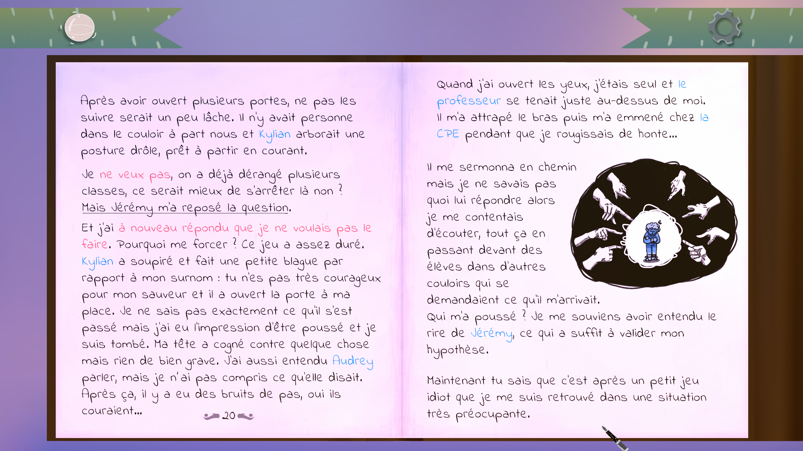
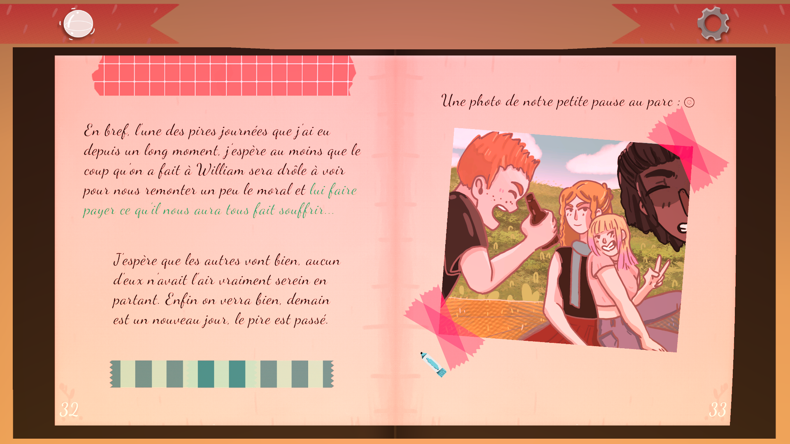
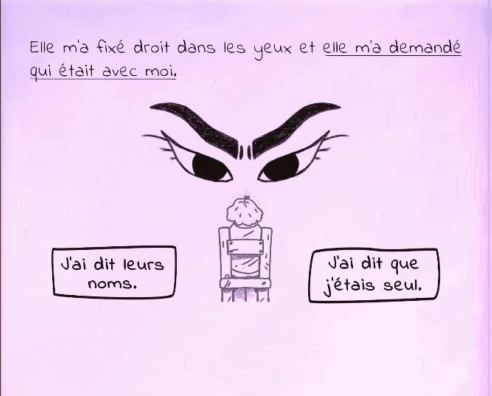

<h1 align="center">Hi there👋 Nice to meet you, I'm Victor Mauroy 😉</h1>
<h3 align="center"><b>Back-end developper (C# / .Net / Unity)</b></h3>

## About me 📰🔍
Hey🙂 I'm a Junior developper from Amiens/Lille in France.  
I'm mainly doing **Web Back-end** and **Unity Engine** Development.  
Currently doing a C# and .NET training to enhance my skills and also looking for a full-time job! 

## **Contact me 📬**

## Skills ⚔💻

### Languages 
Experienced :  
(5 years, mainly as game dev)

Can work with 
 

### Back-end Development

### Game Development

### Databases

### Design tools

### OS 

### Interests & Coming Soon

## Game Dev projects

Show more

### Cher Journal
Description: Cher journal is a narrative game where you follow the point of view and make choices for two teens who write, in their diary, their everyday life.

This is a narrative game around the themes of the teenages years and school bullying.

[**Presentation page**](https://mauroyvictor.wixsite.com/website/cher-journal)

**Pictures:**

Show

