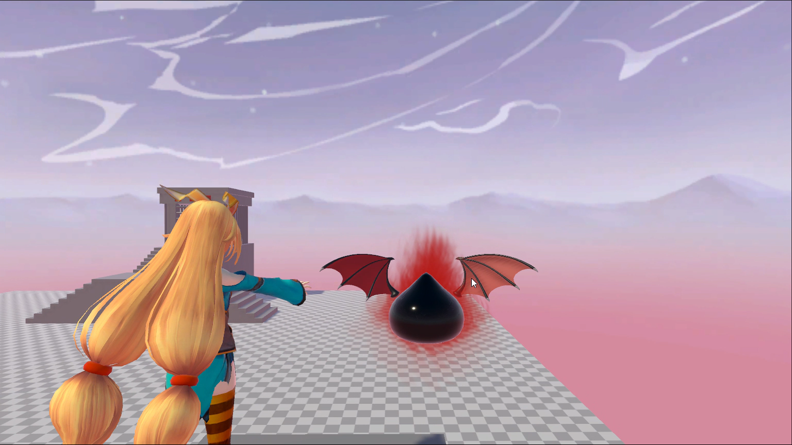
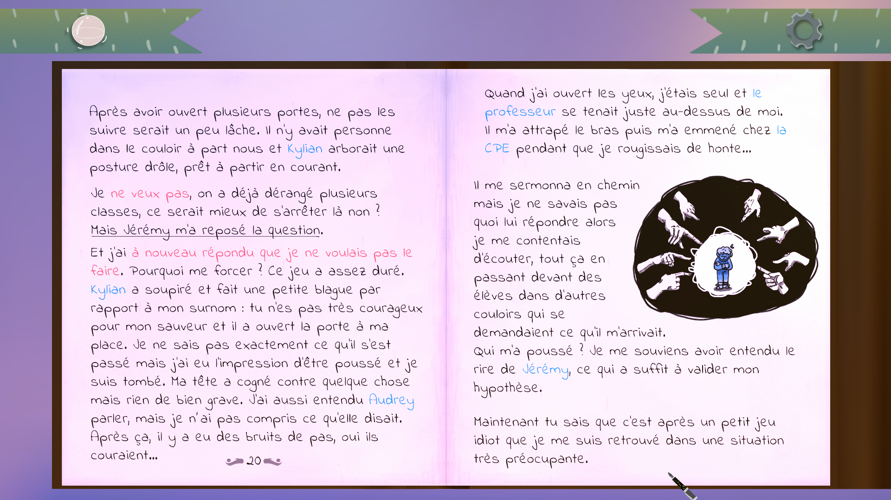
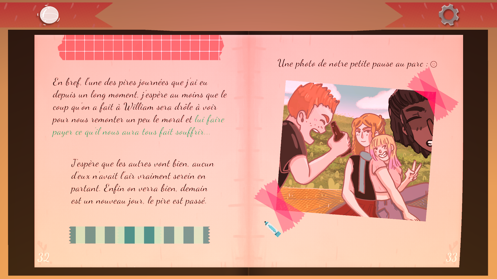
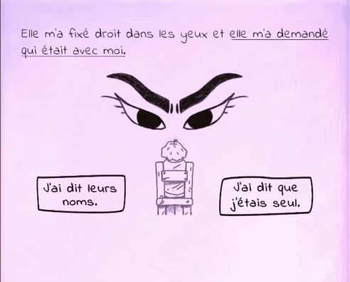

<h1 align="center">Hi there👋 Nice to meet you, I'm Victor Mauroy 😉</h1>
<h3 align="center"><b>Back-end developper (C# / .Net / Unity)</b></h3>

## About me 📰🔍
Hey🙂 I'm a Junior developper from Amiens/Lille in France.  
I'm mainly doing **Web Back-end** and **Unity Engine** Development.  
Currently doing a C# and .NET training to enhance my skills and also looking for a full-time job! 

## **Contact me 📬**

## Skills ⚔💻

### Languages 
Experienced :  
(5 years of practice, game dev + backend)

Can work with 
 

### Back-end Development

### Game Development

### Databases

### Design tools

### OS 

### Cloud, Deployement & Other tools

### Interests & Coming Soon

## :video_game: Game Dev projects :video_game:

### :european_castle: On-Going project :construction:
**Description:** 
Move through the air with ease and throw, tumble or crush your enemies to progress into this 3D platformer game.

*Note: This is an on-going project, there currently isn't any download links but you can check the github page in the links section bellow.*

**Links:**
- [**Presentation**](https://mauroyvictor.wixsite.com/website/currentproject)
- [**Github repository**](https://github.com/VictorMauroy/The-Hardest-Dungeon)

**Pictures**

:mag_right: Show :art:

### :book: Cher Journal :orange_book:
**Description:** Cher journal is a narrative game where you follow the point of view and make choices for two teens who write, in their diary, their everyday life.

This is a narrative game around the themes of the teenages years and school bullying.

**Links:** 
- [**Presentation**](https://mauroyvictor.wixsite.com/website/cher-journal) 
- [**Trailer**](https://www.youtube.com/watch?v=xudUMBcEUQ4)
- [**Download**](https://roman-grzegorzewski.itch.io/cher-journal)

**Pictures:**

:mag_right: Show :art:

### :office: E-artsup Lille School Game :art:
**Description:**
Made as a request by our school, that game objective was to allow school's candidates to better understand the atmosphere and the lessons of the games cursus. It also give a lot of advices to start creating games and quickly adapt to the video game universe! There is also a few mini-games.

**Links:** 
- [**Presentation and download**](https://mauroyvictor.wixsite.com/website/l-%C3%A9cole-e-artsup-lille)

**Pictures:**

:mag_right: Show :art:

### **Want to see more projects ?** :video_game: :
-> Check my game dev website : https://mauroyvictor.wixsite.com/website/mes-jeux
